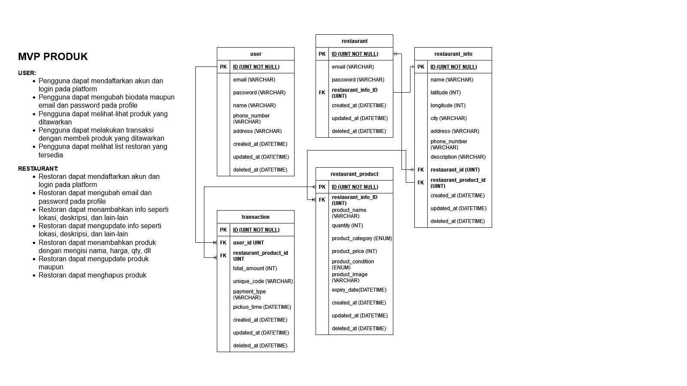

# Food ResQ

    

## About Project
Sampah makanan merupakan isu global yang mendesak, dengan perkiraan sepertiga dari semua makanan yang diproduksi di dunia terbuang sia-sia. Hal ini tidak hanya berdampak negatif pada lingkungan, tetapi juga menimbulkan masalah kesehatan, karena makanan yang terbuang dapat menjadi tempat berkembang biak bagi bakteri dan jamur. FoodResQ hadir sebagai solusi inovatif untuk mengatasi permasalahan ini dengan memanfaatkan teknologi digital untuk menghubungkan individu, restoran, dan toko dalam upaya untuk mengurangi sampah makanan.

Food ResQ (Food Rescue) adalah aplikasi yang bertujuan untuk menjembatani individu, restoran, dan toko untuk mendistribusikan makanan berlebih yang masih layak kepada mereka yang membutuhkan, untuk mengurangi limbah makanan. Restoran, individu, dan toko-toko makanan dapat dengan mudah membagikan dan menjual makanan berlebih mereka melalui aplikasi FoodResQ dengan harga yang lebih terjangkau

## Features
Fitur-fitur yang dimiliki FoodresQ API

### User
- Pengguna dapat mendaftarkan akun dan login pada platform
- Pengguna dapat mengubah biodata maupun email dan password pada profile
- Pengguna dapat melihat-lihat produk yang ditawarkan
- Pengguna dapat melakukan transaksi dengan membeli produk yang ditawarkan
- Pengguna dapat melihat list restoran yang tersedia

### Restaurant
- Restoran dapat mendaftarkan akun dan login pada platform
- Restoran dapat mengubah email dan password pada profile
- Restoran dapat menambahkan info seperti lokasi, deskripsi, dan lain-lain
- Restoran dapat mengupdate info seperti lokasi, deskripsi, dan lain-lain
- Restoran dapat menambahkan produk dengan mengisi nama, harga, qty, dll
- Restoran dapat mengupdate produk
- Restoran dapat menghapus produk

## Tech Stacks
Tech stack yang digunakan:
- App Framework : Echo Framework 
- ORM           : GORM
- Database      : MySQL
- Deploymemt    : AWS
- Code Structure: Clean Architecture
- Authentication: JWT

## API Documentation
API documentation   : 

## ERD

    

## Presentations Slide
Link presentasi
https://docs.google.com/presentation/d/1iCY9M7Frk2iWk5JxK0rMSBbtzxIgPczKAeftEpZHPN4/edit?usp=sharing